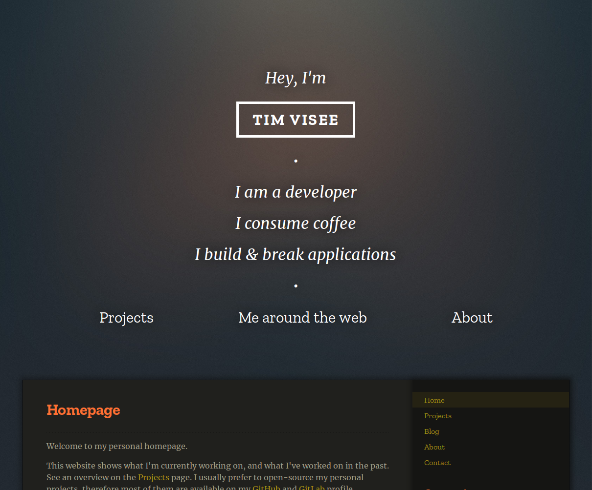

[![Build and deployment status on GitLab CI][gitlab-ci-master-badge]][gitlab-ci-link]

[gitlab-ci-link]: https://gitlab.com/timvisee/timvisee.com/pipelines
[gitlab-ci-master-badge]: https://gitlab.com/timvisee/timvisee.com/badges/master/pipeline.svg

# timvisee.com
The source code for my personal website.
View it live at [timvisee.com](https://timvisee.com/).



The majority of the content is formatted in Markdown, located in the
[`content/`](./content/) directory.
It includes a custom theme as well ([zenn][zenn]) for the visuals.

This website is built with [Zola][zola], a static website generator.
See it's documentation for more information on how this project is structured.

Any pull requests for changes on the website are welcome.

To run a local instance of this website, be sure to install [Zola][zola] first.
Then run:

```bash
# Clone the repository
git clone https://gitlab.com/timivsee/timvisee.com
cd timvisee.com

# Build and serve a local instance
zola serve
```

## License
This project is released under the GNU GPL-3.0 license.
Check out the [LICENSE](./LICENSE) file for more information.

[zola]: https://getzola.org./
[zenn]: ./themes/zenn/
