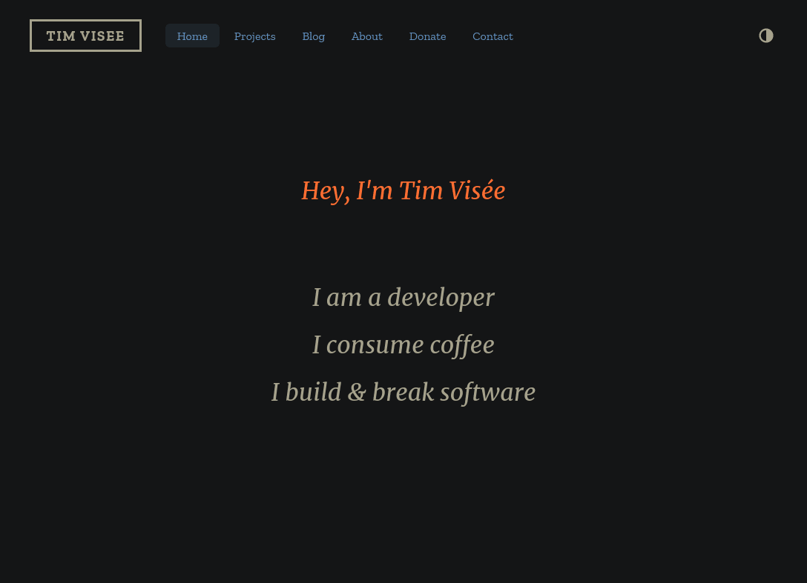
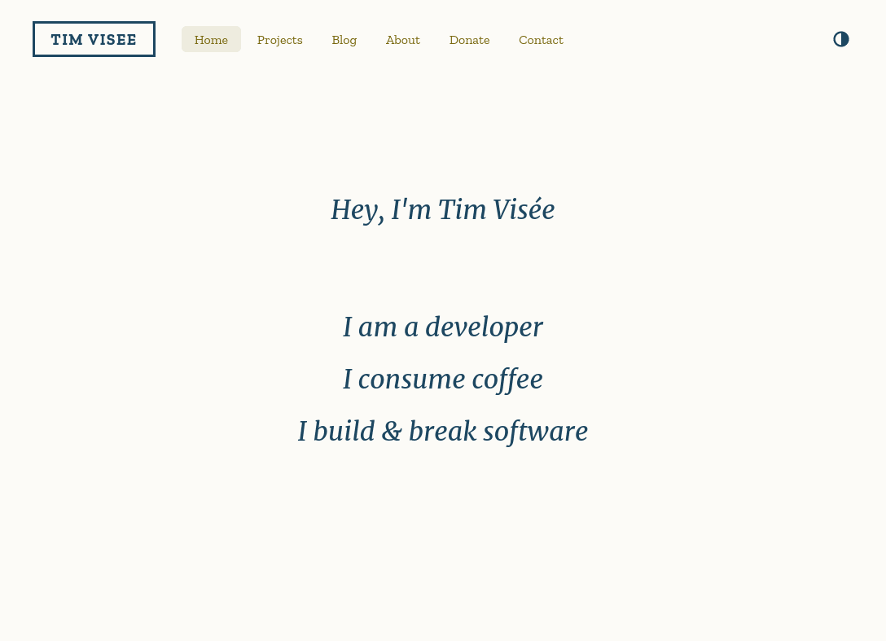

[![Build and deployment status on GitLab CI][gitlab-ci-master-badge]][gitlab-ci-link]

[gitlab-ci-link]: https://gitlab.com/timvisee/timvisee.com/pipelines
[gitlab-ci-master-badge]: https://gitlab.com/timvisee/timvisee.com/badges/master/pipeline.svg

# timvisee.com
The source code for my personal website.
View it live at [timvisee.com][site].

[][site]
[][site]

## Content
The majority of the content is formatted in Markdown, located in the
[`./content`](./content/) directory.
It includes a custom theme as well ([zenn][zenn]) for the visuals.

This website is built with [Zola][zola], a static website generator.
See it's documentation for more information on how this project is structured.

Any pull requests for changes on the website are welcome.

## Usage
To run a local instance of this website, be sure to install [`zola`][zola] first.
Then run:

```bash
# Clone the repository
git clone https://gitlab.com/timvisee/timvisee.com
cd timvisee.com

# Build and serve a local instance
zola serve --open

# Open: 127.0.0.1:1111
# Edit files in ./content, view live changes your browser
```

The latest [`deploy`][branch-deploy] branch is automatically deployed live at [timvisee.com][site].

## License
This project is released under the GNU AGPL-3.0 license.
Check out the [LICENSE][license] file for more information.

Feel free to use parts of this project, such as the custom [zenn][zenn] theme,
in your own project conform the [LICENSE][license].

[site]: https://timvisee.com/
[zola]: https://getzola.org/
[zenn]: ./themes/zenn/
[branch-deploy]: https://gitlab.com/timvisee/timvisee.com/tree/deploy
[license]: ./LICENSE
